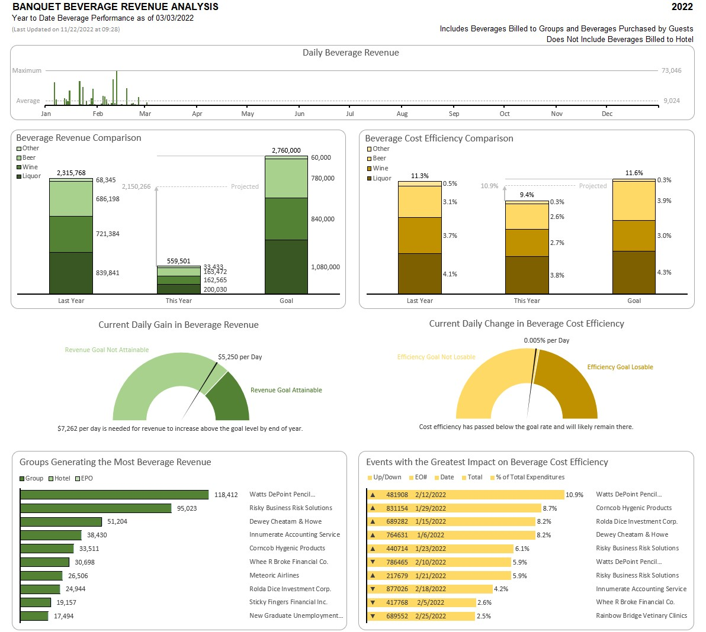
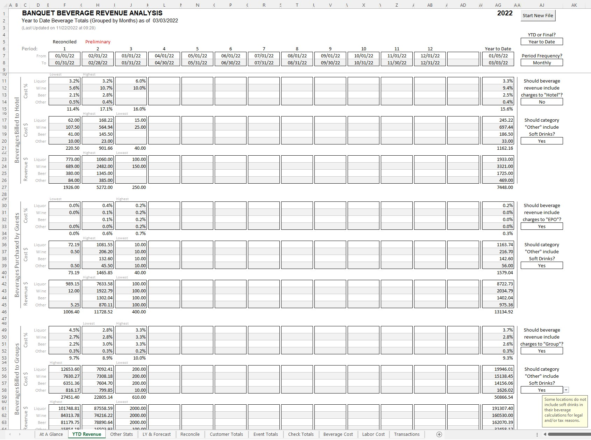
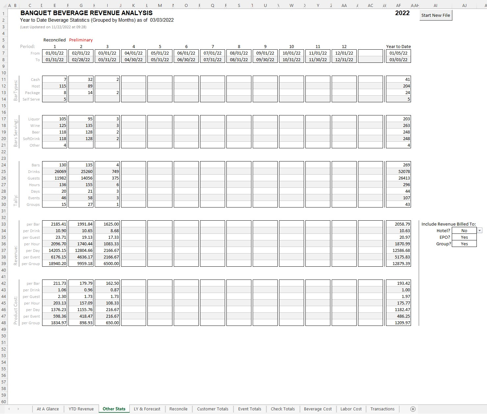
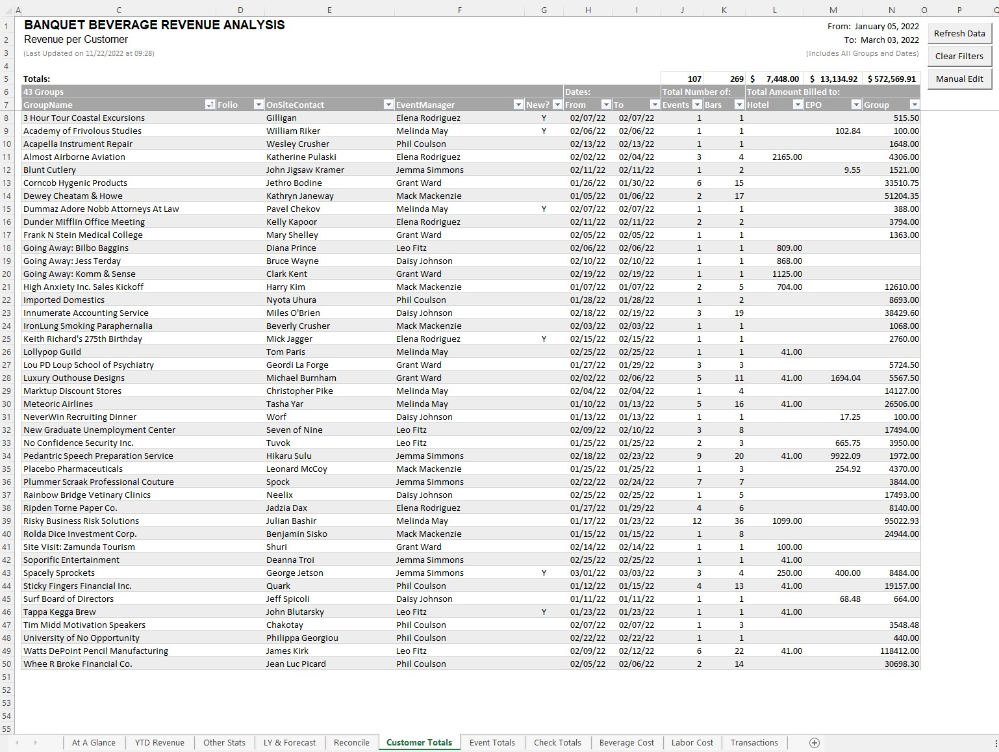
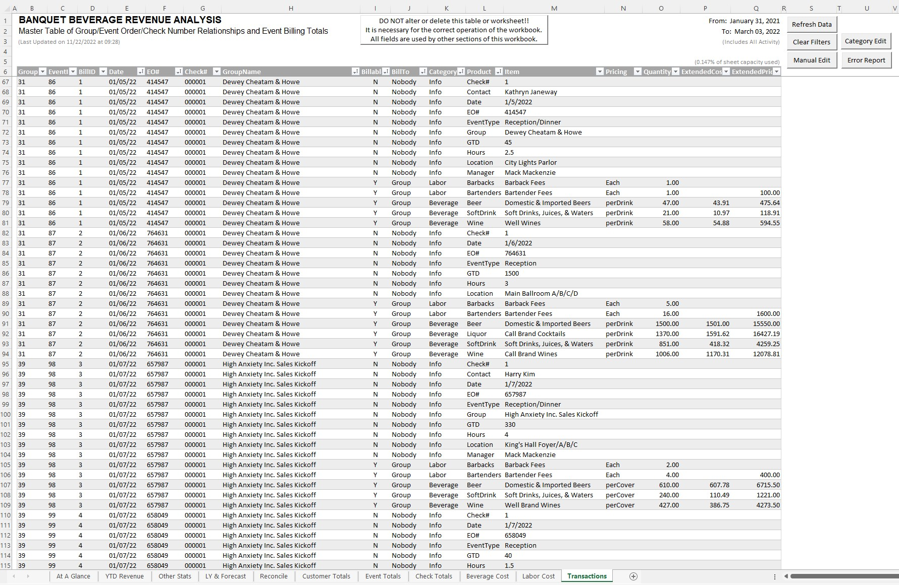
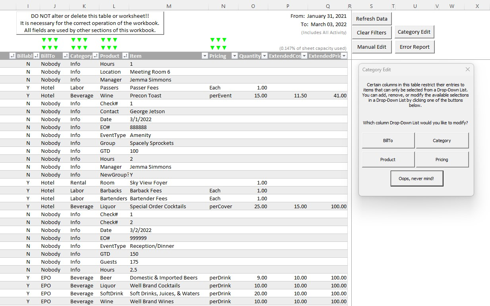
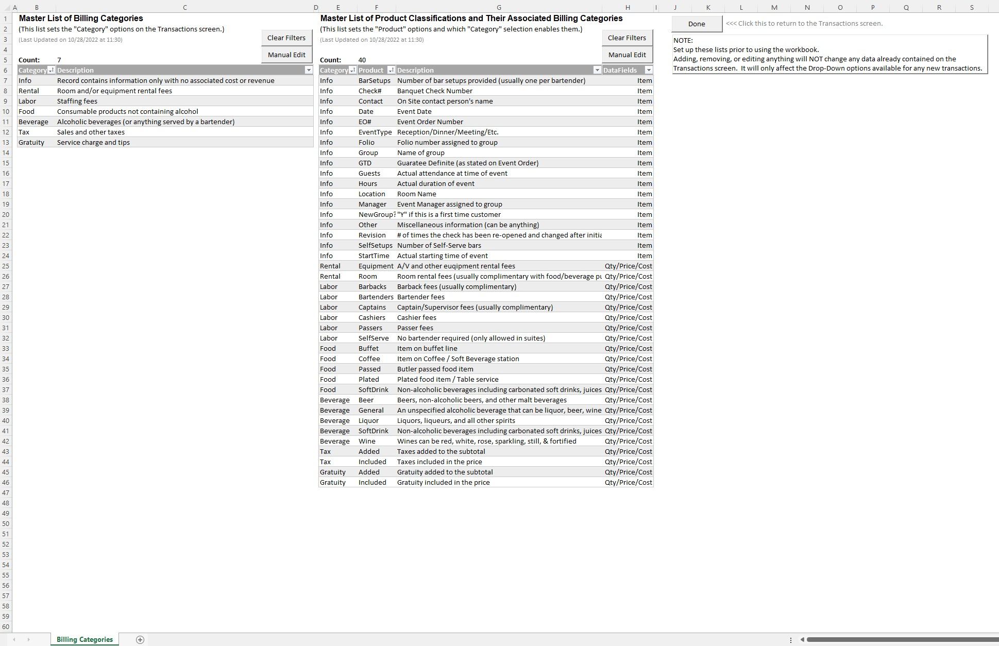
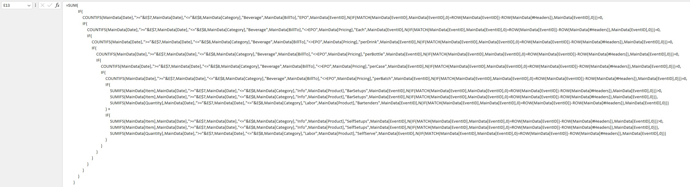

<h1> That's a Lot of Margaritas!   (Using Excel to track cost and revenue for a fictitious caterer's beverage operation) </h1>

#### Overview:  

During my tenure as a banquet captain at a large convention hotel, I was put in charge of the bars and wine service for all of the hotel's catered events. 
This was a complex operation with many moving parts and it often raised questions from my many bosses about how I ran it. 
Was my revenue on target to surpass last year and/or the goal for this year? Am I upselling our wines? Why is my cost higher this month? 
Why did I need so many bartenders last week? Why did I spend $1000 on limes?  

Since the systems in which we recorded our sales, purchases, labor, and inventory usage were seperate and didn't share data, I had to come up with another method 
to tie together all the details of my day-to-day operation and make that information available to my bosses in a way that was useful to them. 
Thus began my deep dive into the world of Excel!  

At first this project started as a simple spreadsheet to record my bartender's sales each day so that I could compare it to the Accounting Department's 
revenue reports. But over time, I started adding more details in order to preemptively answer the frequent questions from my bosses. 
How much of each sale was liquor, beer, or wine? How much did each cost? Who were the customers? How many guests attended the events? For how long? 
Had they been here before? Which ones had the greatest impact? 
Eventually, that simple spreadsheet morphed into a much larger workbook with multiple worksheets containing multiple tables, and charts, 
and complicated array formulas in many of the cells. I later added VBA code to keep the sheets properly formatted for printing. And then more VBA code to assist 
with data entry and period-end reconciling, and still more VBA code to pull data from other workbooks when the data entry became formidable.  

I no longer work in that industry, but as this project was very important to me for so long, I still open the workbook from time to time to make some tweaks. 
I add features I wish I had thought of while I was still working in that role. I now know that this project would have been better suited for a business intelligence 
application and/or a database application, but at that time, Excel was the only tool I had access to. I have created this repository and included a demonstration 
version of this project (with fictitious entries, of course) because I think it nicely illustrates how far you can push Excel to create solutions for your data 
analysis and visualisation needs.   

#### Repository Folder/File Organization:

> **"Images"** (contains images for the ReadMe file)  
> **"Excel Files"** (project folder)  
> - *"BevReport Demo.xlsm"* (Excel Macro-Enabled Workbook used for this project)  

(Please do not move, rename, delete, or alter!)

#### Note:  
The workbook for this project ("BevReport Demo.xlsm") was designed for users with minimal experience with Excel, therefore there are no Pivot Tables. 
Also, I avoided the temptation to use any of the newer array functions that were introduced with Microsoft365 so that this workbook would work with 
older versions of Excel.   

#### Screen1: Year At A Glance Dashboard  
This is a "Progress Toward a Goal" type of dashboard that uses stacked columns to illustrate how my two main KPIs (Revenue and Cost Efficiency) 
compared with the previous year and to the forecast. Note the addition of lines and arrows to indicate if the KPIs are moving toward or away from the goal 
and how far they would reach by the end of the year. The two speedometers below were created by layering several pie charts on top of each other. The most recent 
14 days of data were used to calculate the speeds shown on the speedometers. Also included on this dashboard is a timeline to quickly access how much time is 
left in the year to achieve the goals and also bar charts to illustrate the top 10 contributors to each of the KPIs. With this dashboard, you can quickly 
determine if you have met your goals, and if not, whether or not you have enough time and momentum to reach them.  

   

#### Screen2: Year To Date Revenue and Cost Totals  
This is a printable page suitable for reports that summarizes the revenue and cost totals for the year. The totals are grouped by months accross the top 
and by the purchasing entity (Hotel, Groups, or Individual Guests) down the side. The revenue and cost is further subdivided by the product category: Liquor, 
Wine, Beer, and Other. The user can select whether or not soft drink purchases should be included in the totals and also which purchasing entities should be 
included in actual beverage revenue and cost totals.

   

#### Screen3: Year to Date Statistics  
This screen is also a "report ready" page that aggregates some other relevant statistics such as total count of bars provided, guests served, drinks served, 
events with beverage service, days with beverage events, and groups with beverage events. The average cost and revenue earned per each of these items is also 
calculated. There were numerous other statistics that I could have included here, but these were the concepts that I was most interested in at the time. In a 
future version of this workbook, I would like to include a timeline filter and some slicers to allow the user to investigate specific date ranges or groups or 
events.

   

#### Customer Totals Screen:  
This screen is also a "report ready" page that summarizes the revenue earned per group. This screen and the other "Totals" and "Cost" screens are in a table format 
so that the user can sort and filter the information at their whim. All the rows of this table are populated formulaically from the Main Data Table using Sumifs, 
Countifs, and Vlookup functions.

   

#### Main Data Table:  
All the other screens in this workbook use the Main Data Table in their various calculations. And because entering the data into this table by hand is very 
time consuming, I created VBA subroutines to automatically populate it from external sources (ie: other workbooks). 
I originally used separate tables for customer info, event info, billing info, and transaction details. After later learning about Excel's internal data model, 
I thought I could use that feature to join the tables togther on their various primary and foreign keys. 
However, I found that employing this method caused the workbook to quickly exceeded our corporate email attachment size limit. 
I then tried using a single flat table, but found the number of columns needed was too large to visually edit or print. 
So I opted for an unorthodox approach: Use multiple rows for each transaction, where some rows contained only categorical data, and others contained the 
numerical data, and identify which rows belonged togther by use of a unique transaction ID. 
I also used an event ID and a group ID to associate the rows with their specific groups and events which also auto-populates several field on each row. 
The data in the table is organized similar to a JSON.
This resulted in a much longer single table, but it had much fewer columns and was easily editable and printable, and it didn't require as much physical memory. 
However, there are several caveats with using this technique which I will elucidate later. 

   

#### Clicking the Category Edit Button:  
Several of the columns in the Main Data Table have their entries limited to the items in drop-down selection lists. To edit the items available in these 
selection lists, the user can click the "Category Edit" button. This will display a dialog box where the user can choose which selection list they would 
like to edit. Depending on which button they click next, they will be taken to the appropriate screen.

   

#### The Category Edit Screen:  
This is the screen where the user can edit the Billing Categories and the Product Classifications that can be used in the Main Data Table. 
Notice that all the other screens are hidden during this process. The user must click the "Done" button to return to the workbook.

   

#### Example of Complicated Array Formulas:  
There are several limitations when not using a flat normalized table for your dataset. One is that you cannot use pivot tables or charts. 
Another is that you sometimes have to use very clever array formulas (previously known as CSE formulas) to slice and access the data for your calculations. 
The formula shown below calculates the number of bars in a month that were not cash bars nor was the customer charged by the drink (known as package bars). 
Notice that you can expand the formula box and use spaces and returns within your formula to make it more readable.

    

